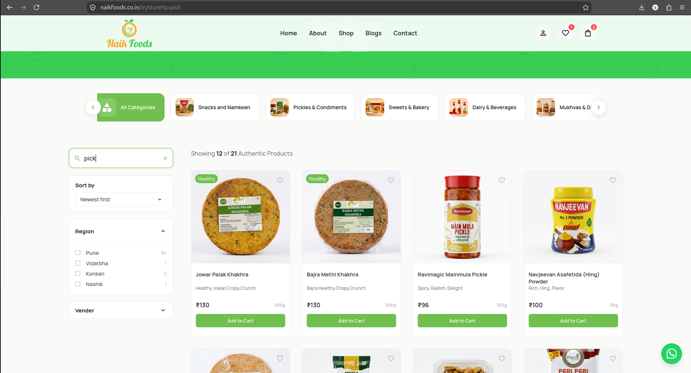
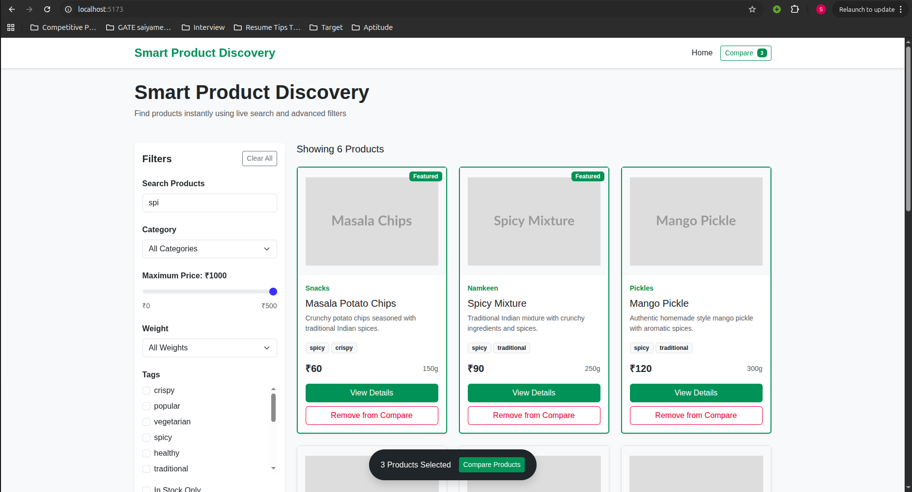
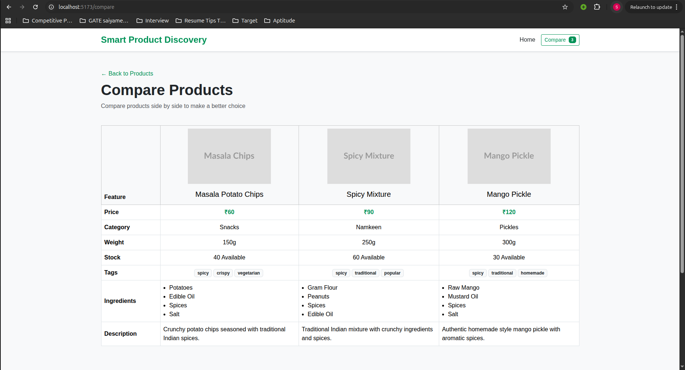
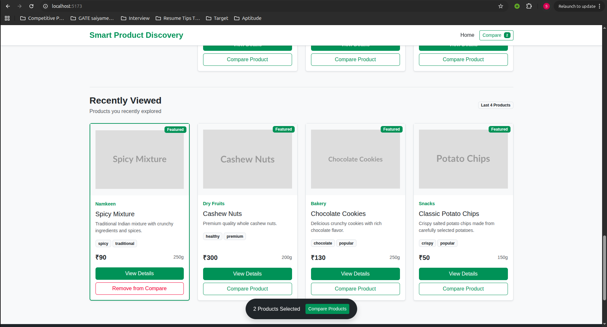

# 🛒 Naik Foods – E-commerce Feature Enhancement

A full-stack MERN e-commerce application enhancement project developed for **Naik Foods**. This project focuses on improving the overall product discovery and shopping experience by implementing useful features such as **Improved Partial Search, Product Comparison, and Recently Viewed Products**.

---

## 🔗 Quick Links

| Resource | Link |
|---|---|
| 🚀 Live Demo | `<deployment-url>` |
| 💻 GitHub Repository | `<your-github-repository-url>` |
| 👨‍💻 Author | Sanket Sadashiv Hajare |

---

## 1. Project Overview

Naik Foods is an e-commerce platform where users can browse and purchase food products. While analyzing the existing application, several opportunities were identified to improve the user experience during product discovery and decision-making.

This project enhances the existing platform by introducing three major features:

- 🔍 Improved Partial Search
- ⚖️ Product Comparison
- 🕒 Recently Viewed Products

These features help users find products more efficiently, compare multiple products before purchasing, and quickly revisit products they have previously explored.

---

## 2. Problem Identified

During the analysis of the existing e-commerce platform, the following challenges were identified:

- Users may struggle to find products when entering incomplete search terms.
- There was no convenient way to compare multiple products side by side.
- Users could lose track of products they previously viewed.
- Product discovery and decision-making required additional navigation.

These issues can affect the overall shopping experience and make it harder for users to discover and evaluate products efficiently.

### Problem Screenshots

> Add screenshot(s) showing the gap on the live site — e.g. the header/store page with no search bar.

```text

```

---

## 3. Features Developed

### 🔍 Improved Partial Search

Allows users to find products even when they enter incomplete or partial product names.

### ⚖️ Product Comparison

Allows users to select multiple products and compare important details side by side.

### 🕒 Recently Viewed Products

Tracks products viewed by users and displays them for quick access later.

---

## 4. Why These Features?

These features were selected because they directly improve important parts of the e-commerce user journey.

| Feature | Benefit |
|--------|---------|
| Improved Search | Helps users find products faster |
| Product Comparison | Helps users make better purchasing decisions |
| Recently Viewed | Improves navigation and product rediscovery |

Together, these features improve:

- Product discoverability
- User convenience
- Shopping experience
- Purchase decision-making
- User engagement

---

## 5. Technologies Used

This project is built using the **MERN Stack**.

### Frontend

- React.js
- JavaScript
- CSS
- Axios

### Backend

- Node.js
- Express.js

### Database

- MongoDB

### Additional Tools

- Git & GitHub
- REST APIs
- Local Storage

---

# 6. Feature 1 – Improved Search

## Problem

Traditional search functionality may require users to enter the exact product name. This can create difficulties when users:

- Remember only part of a product name
- Enter incomplete keywords
- Use different capitalization
- Search using partial product information

For example, if a product is named:

```text
Organic Turmeric Powder
```

A user should still be able to find it by searching:

```text
tur
```

or

```text
turmeric
```

---

## Solution

An improved search mechanism was implemented to support **partial and flexible product searches**.

The search functionality matches the user-entered keyword with product names and relevant product information.

---

## How It Works

1. User enters a keyword in the search bar.
2. The frontend captures the search input.
3. A request is sent to the backend API.
4. The backend searches MongoDB using partial matching.
5. Matching products are returned.
6. Results are displayed dynamically to the user.

### Example Search Flow

```text
User Input
    ↓
Search API Request
    ↓
Express.js Backend
    ↓
MongoDB Partial Search
    ↓
Matching Products
    ↓
Display Results
```

### Example MongoDB Query

```javascript
const products = await Product.find({
  name: {
    $regex: searchKeyword,
    $options: "i",
  },
});
```

The `$regex` operator enables partial matching, while `"i"` makes the search case-insensitive.

---

## Screenshot

text



---

# 7. Feature 2 – Product Comparison

## Problem

When purchasing products online, users often need to compare multiple products before making a decision.

Without a comparison feature, users need to:

- Open one product
- Remember its details
- Navigate back
- Open another product
- Manually compare information

This creates unnecessary navigation and makes decision-making difficult.

---

## Solution

A **Product Comparison** feature was implemented that allows users to select multiple products and compare them side by side.

Users can easily compare important product details without repeatedly switching between product pages.

---

## How It Works

1. User clicks the **Compare** button on a product.
2. The selected product is added to the comparison list.
3. Multiple products can be selected.
4. User opens the comparison page.
5. Product information is displayed in a comparison table.

### Comparison Flow

```text
Select Product
      ↓
Add to Comparison List
      ↓
Select Another Product
      ↓
Open Comparison Page
      ↓
Compare Product Details
```

### Example Comparison Table

| Feature | Product A | Product B |
|--------|-----------|-----------|
| Product Name | Product A | Product B |
| Price | ₹100 | ₹120 |
| Category | Spices | Spices |
| Description | Available | Available |

---

## Screenshot

## Product Comparison



---

# 8. Feature 3 – Recently Viewed Products

## Problem

Users frequently browse multiple products before deciding what to purchase.

However, after navigating through different pages, users may have difficulty finding products they previously viewed.

This can result in:

- Repeated searches
- Unnecessary navigation
- Poor user experience
- Lost product discovery opportunities

---

## Solution

A **Recently Viewed Products** feature was implemented.

The application tracks products viewed by users and displays them in a dedicated section for quick access.

---

## How It Works

1. User opens a product details page.
2. The product ID is stored as recently viewed.
3. Duplicate entries are avoided.
4. A limited number of recent products are maintained.
5. Recently viewed products are displayed to the user.

### Recently Viewed Flow

```text
User Opens Product
       ↓
Product ID Captured
       ↓
Store Recently Viewed Product
       ↓
Remove Duplicates
       ↓
Display Recent Products
```

### Example Logic

```javascript
const recentlyViewed = JSON.parse(
  localStorage.getItem("recentlyViewed")
) || [];

const updatedProducts = [
  productId,
  ...recentlyViewed.filter((id) => id !== productId),
].slice(0, 5);

localStorage.setItem(
  "recentlyViewed",
  JSON.stringify(updatedProducts)
);
```

This approach keeps the most recently viewed products available while avoiding duplicate entries.

---

## Screenshot

> Add your recently viewed products screenshot here.

## Recently Viewed Products



---

# 9. Technical Implementation

The project follows a client-server architecture.

### Frontend Responsibilities

The React frontend handles:

- User interface
- Search input
- Product selection
- Comparison interface
- Recently viewed product display
- API communication

### Backend Responsibilities

The Node.js and Express.js backend handles:

- API endpoints
- Product data retrieval
- Search queries
- Database communication
- Business logic

### Database Responsibilities

MongoDB stores:

- Product information
- Product categories
- User-related data
- Other application data

---

## API Flow

```text
React Frontend
      │
      │ HTTP Request
      ▼
Express.js API
      │
      │ Database Query
      ▼
MongoDB
      │
      │ Product Data
      ▼
Express.js API
      │
      │ JSON Response
      ▼
React Frontend
```

---

# 10. Project Architecture

The project follows a typical MERN architecture.

```text
smart-product-discovery/
│
├── client/
│   ├── src/
│   │
│   │── components/
│   │   ├── Filters.jsx              # Advanced product filtering
│   │   ├── Pagination.jsx           # Product pagination
│   │   ├── ProductCard.jsx          # Product display and comparison selection
│   │   ├── RecentlyViewed.jsx       # Recently viewed products feature
│   │   └── SearchBar.jsx            # Live partial product search
│   │
│   │── pages/
│   │   ├── Home.jsx                 # Main product discovery and filtering logic
│   │   ├── ProductDetails.jsx       # Detailed product information
│   │   └── CompareProducts.jsx      # Compare up to 3 products
│   │
│   │── services/
│   │   └── productApi.js            # API calls for product data
│   │
│   │── utils/
│   │   └── recentlyViewed.js        # Recently viewed products logic
│   │
│   └── App.jsx                      # Application routes and shared state
│
├── server/
│   ├── src/
│   │   ├── config/
│   │   │   └── database.js          # MongoDB connection
│   │   ├── models/
│   │   │   └── product.js           # Product database schema
│   │   ├── routes/
│   │   │   └── product.js           # Product API endpoints
│   │   └── app.js                   # Express server setup
│   │
│   └── seed.js                      # Initial product data seeding
│
├── screenshots/
│   ├── problem-no-search.png
│   ├── search.png
│   ├── comparison.png
│   └── recently-viewed.png
│
└── README.md
```

---

# 11. Setup & Installation

## Prerequisites

Make sure you have the following installed:

- Node.js
- npm
- MongoDB
- Git

---

## Clone the Repository

```bash
git clone <your-repository-url>
```

Navigate to the project directory:

```bash
cd naik-foods
```

---

## Install Backend Dependencies

```bash
cd server
npm install
```

---

## Install Frontend Dependencies

Open another terminal and run:

```bash
cd client
npm install
```

---

## Environment Variables

Create a `.env` file inside the server directory.

```env
PORT=5000
MONGO_URI=your_mongodb_connection_string
```

Make sure your MongoDB connection string is correctly configured.

---

# 12. How to Run

## Start Backend Server

From the `server` directory:

```bash
npm run dev
```

or:

```bash
npm start
```

The backend server should run on:

```text
http://localhost:5000
```

---

## Start Frontend

From the `client` directory:

```bash
npm run dev
```

or:

```bash
npm start
```

The frontend application will run on the local development URL displayed in the terminal.

---

# 13. Screenshots / Demo

## Improved Partial Search


---


# 14. Deployment & Repository

The application can be deployed using the following services:

| Layer | Suggested Platform |
|---|---|
| Frontend | Vercel  |
| Backend | Render  |
| Database | MongoDB Atlas |


---


# Conclusion

This project focuses on improving the shopping experience of the Naik Foods e-commerce platform through practical feature enhancements.

The implementation of **Improved Partial Search**, **Product Comparison**, and **Recently Viewed Products** helps users discover products more easily, make informed purchasing decisions, and revisit previously explored products.

These enhancements demonstrate how small but meaningful features can significantly improve the usability and overall experience of an e-commerce application.

---

## 👨‍💻 Author

**Sanket Sadashiv Hajare**

- GitHub: `<your-github-profile>`
- LinkedIn: `<your-linkedin-profile>`
